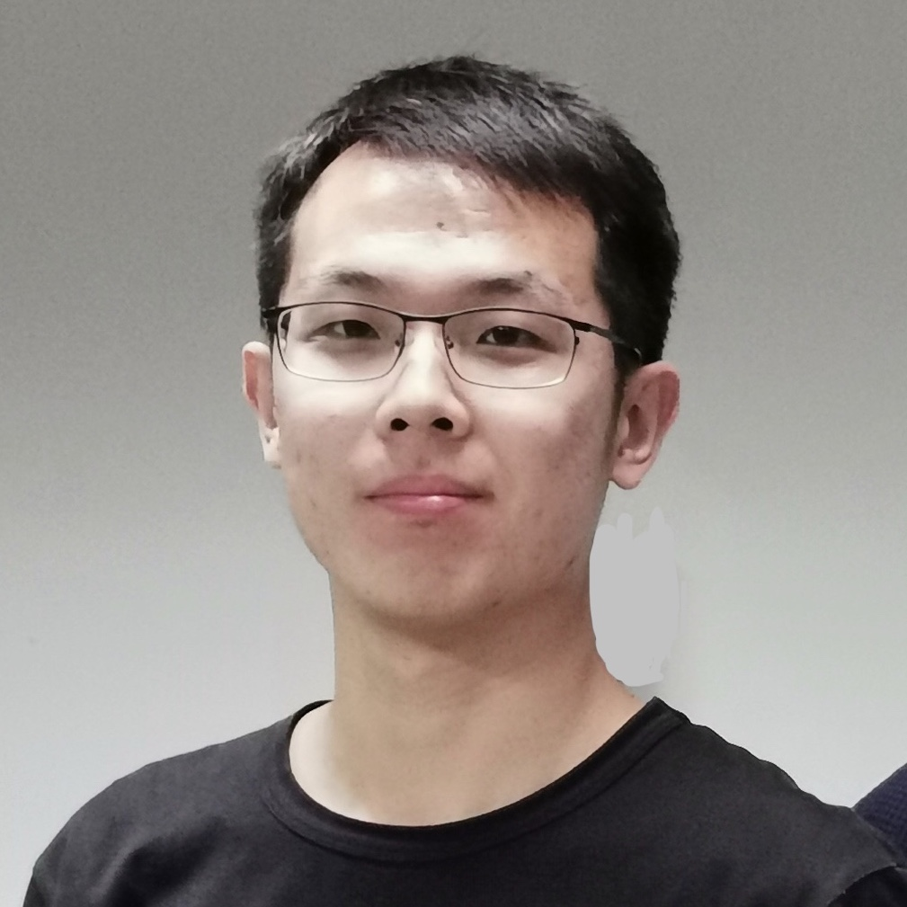

## About Me

Hi! I am a 2nd year PhD student of [VIE lab](http://www.vie.group/) at Peking University. My supervisors are [Tingting Jiang](http://www.vie.group/ttj) and Yizhou Wang. 

Find out more at my [Github](https://github.com/Finspire13). 

## Research Interest
*Surgical Video Analysis:*
1. Surgical skill assessment
2. Surgical tool segmentation
3. Surgical event detection 

*Action Recognition:*
1. Temporal action localization
2. Temporal action segmentation

## Publications

 Year | Title | Author | More
-----|-----|-----|-----
MICCAI 2019 Oral | Surgical Skill Assessment on In-Vivo Clinical Data via the Clearness of Operating Field | **Daochang Liu**, Tingting Jiang, Yizhou Wang, Rulin Miao, Fei Shan, Ziyu Li | [Paper](http://www.vie.group/media/pdf/paper37.pdf) 
CVPR 2019 | Completeness Modeling and Context Separation for Weakly Supervised Temporal Action Localization | **Daochang Liu**, Tingting Jiang, Yizhou Wang | [Code](https://github.com/Finspire13/CMCS-Temporal-Action-Localization)
MICCAI 2018 | Deep Reinforcement Learning for Surgical Gesture Segmentation and Classification | **Daochang Liu**, Tingting Jiang | [Code](https://github.com/Finspire13/RL-Surgical-Gesture-Segmentation)

## Services

1. Reviewer of MICCAI 2019

## Contact

* Email: [finspire13@gmail.com](mailto:finspire13@gmail.com)

## Vlog

* [Vlog - CVPR 2019](https://www.bilibili.com/video/av56547471)

